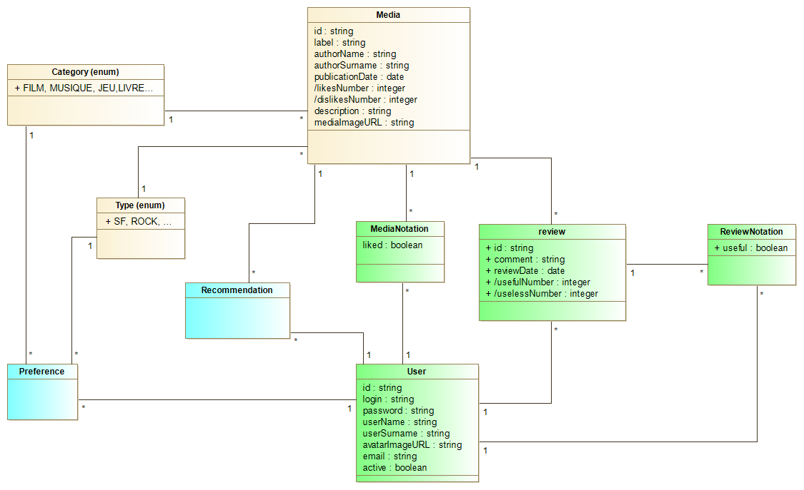

# BACK - Projet Fil Rouge
Le projet fil rouge consiste à créer un site permettant aux utilisateurs de donner leur avis et de mettre des commentaires sur des médias. 
Des recommandations pourront être adressées aux utilisateurs du site en fonction de leurs préférences. 

Ci-dessus:
- la partie jaune correspond au MVP (Minimal Viable Product).
- la partie verte correspond au MMP (Minimal Marketable Product).
- la partie bleue correspond au produit final. 

L'affichage à l'écran de la liste des médias présents dans la base h2 constitue le MVP de cette application. 

API mise à disposition du front:
- GET/medias : pour la liste des medias sur MediaListComponent
- GET/medias/{mediaID} : renvoie les informations d'un média, la liste des reviews associées à ce média (avec le nombre de useful/useless) et la liste des likes/dislikes (likes, avec user login et id). Cette API permet d'alimenter toutes les informations de DetailComponent.
- POST/medias/{mediaID}/notation{userLogin} permet d'enregistrer ou de modifier la notation like / dislike d'un utilisateur identifié par son login sur un média donné. Cette API est à appeler pour gérer likeComponent.
- POST/medias/{mediaId}/review/{userLogin} permet d'enregistrer ou de modifier l'avis (review) d'un utilisateur sur un média. Cette API est utilisée lors d'un submit sur enregistrer de PersonalReviewComponent.

La création de média ne fait pas partie de la version du projet livrée dans le premier Sprint. Pour cette raison un fichier data.sql est mis à disposition pour permettre de tester et d'utiliser l'application. 